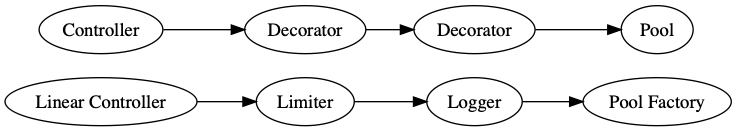

### COBalD Configuration

COBalD can be configure using:
* YAML configuration
* Python configuration

Details can be found in the [`COBalD` Documentation.](https://cobald.readthedocs.io/en/latest/source/daemon/config.html)

--

<!-- .element: style="font-size:70%;" -->
### COBalD YAML Configuration
#### Defining Pipelines

```yaml
pipeline:
  # Makes decision to add remove resources based utilisation and allocation
  - __type__: cobald.controller.linear.LinearController
    low_utilisation: 0.90
    high_allocation: 0.90
    rate: 1 
  # Limits the demand for a resource
  - __type__: cobald.decorator.limiter.Limiter
    minimum: 1
  # Log changes
  - __type__: cobald.decorator.logger.Logger 
    name: 'changes'
  # Factory function to create composite resource pool 
  - __type__: tardis.resources.poolfactory.create_composite_pool
    configuration: 'tardis.yml'
```


[`COBalD` Documentaion](https://cobald.readthedocs.io/en/latest/index.html)

--

<!-- .element: style="font-size:70%;" -->
### Configure Logging

```yaml
logging:
  version: 1
  root:
      level: DEBUG
      handlers: [console, file]
  formatters:
    precise:
      format: '%(name)s: %(asctime)s %(message)s'
      datefmt: '%Y-%m-%d %H:%M:%S'
  handlers:
    console:
      class: logging.StreamHandler
      formatter: precise
      stream: ext://sys.stdout
    file:
      class: logging.handlers.RotatingFileHandler
      formatter: precise
      filename: tardis.log
      maxBytes: 10485760
      backupCount: 3
```

Parameters are directly passed to [`logging.config.dictConfig`](https://docs.python.org/3.7/library/logging.config.html#logging.config.dictConfig)

--

<!-- .element: style="font-size:50%;" -->
#### `cobald.yml`

```yaml
pipeline:
  - __type__: cobald.controller.linear.LinearController
    low_utilisation: 0.90
    high_allocation: 0.90
    rate: 1
  - __type__: cobald.decorator.limiter.Limiter
    minimum: 1
  - __type__: cobald.decorator.logger.Logger
    name: 'changes'
  - __type__: tardis.resources.poolfactory.create_composite_pool
    configuration: 'tardis.yml'
logging:
  version: 1
  root:
      level: DEBUG
      handlers: [console, file]
  formatters:
    precise:
      format: '%(name)s: %(asctime)s %(message)s'
      datefmt: '%Y-%m-%d %H:%M:%S'
  handlers:
    console:
      class : logging.StreamHandler
      formatter: precise
      stream  : ext://sys.stdout
    file:
      class : logging.handlers.RotatingFileHandler
      formatter: precise
      filename: tardis.log
      maxBytes: 10485760
      backupCount: 3
```

--

<!-- .element: style="font-size:80%;" -->
### COBalD Python Configuration
#### Defining Pipelines

```python
from cobald.controller.linear import LinearController
from cobald.decorator.limiter import Limiter
from cobald.decorator.logger import Logger
from tardis.resources.poolfactory import create_composite_pool

pipeline = LinearController.s(low_utilisation=0.9, high_allocation=0.9) >> Limiter.s(minimum=1) >> Logger.s(name='changes') >> create_composite_pool('tardis.yml')
```


